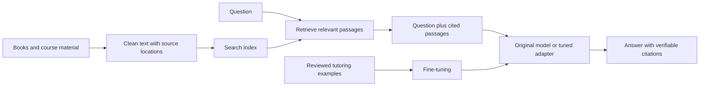

# Fine-tuning source models with custom data

Last reviewed: 2026-09-16

This guide teaches how to turn an existing language model into a more useful
subject tutor or domain assistant. The main lab uses **Qwen2.5-1.5B-Instruct**,
your own instruction/answer examples, and **QLoRA** on one NVIDIA GPU. It then
saves an adapter, merges a deployment model, and converts it to quantized GGUF.
The same experimental process applies to larger models and other subjects.

Start with a small experiment: define one skill, prepare several hundred carefully
reviewed examples, reserve an independent evaluation set, and compare against the
unchanged model. For questions about several books, build a retrieval baseline as
well. More training is useful only when it improves measured outcomes.

You should be comfortable with Python, JSON, the terminal, and basic algebra.
The hardware estimates are planning ranges, not measurements of this lab. The
example APIs and package metadata were checked against official sources; this
guide's GPU training and conversion commands have not been run on this repository's
documentation host. A short smoke run is part of the procedure, not optional evidence
that an entire course has been learned.

## Contents

1. [What training changes](#1-what-training-changes)
2. [Choose fine-tuning, retrieval, or both](#2-choose-fine-tuning-retrieval-or-both)
3. [Find and select a source model](#3-find-and-select-a-source-model)
4. [Plan hardware, storage, and runtime](#4-plan-hardware-storage-and-runtime)
5. [Design the curriculum and dataset](#5-design-the-curriculum-and-dataset)
6. [Understand LoRA and QLoRA](#6-understand-lora-and-qlora)
7. [Lab: environment and source snapshot](#7-lab-environment-and-source-snapshot)
8. [Lab: validate and split your dataset](#8-lab-validate-and-split-your-dataset)
9. [Lab: train and save an adapter](#9-lab-train-and-save-an-adapter)
10. [Evaluate learning and regressions](#10-evaluate-learning-and-regressions)
11. [Merge the adapter for deployment](#11-merge-the-adapter-for-deployment)
12. [How quantization works](#12-how-quantization-works)
13. [Lab: convert, quantize, and run GGUF](#13-lab-convert-quantize-and-run-gguf)
14. [Preserve the experiment and archive lineage](#14-preserve-the-experiment-and-archive-lineage)
15. [Troubleshooting](#15-troubleshooting)
16. [A course-sized sequence of projects](#16-a-course-sized-sequence-of-projects)

## 1. What training changes

A language model predicts the next **token**, a piece of text such as a word,
part of a word, or punctuation. Its **parameters**, or weights, encode patterns
learned during training. A tokenizer translates text into token IDs; it is part
of the model's identity, not an interchangeable accessory.

During supervised fine-tuning (SFT), an example contains a prompt and a desired
answer. The model sees the correct earlier answer tokens during training and
learns to increase the probability of the next correct token. For target answer
tokens `y`, prompt `x`, and trainable parameters `theta`, the basic objective is:

```text
loss = -(1 / number_of_target_tokens) * sum(log P_theta(y_t | x, y_before_t))
```

Backpropagation computes gradients; an optimizer uses them to update trainable
weights. Low loss means the model predicts this dataset well. It does not prove
that its answers are true, that it can generalize, or that it learned a whole
academic discipline. See the [SFT objective](https://huggingface.co/docs/trl/v0.24.0/en/sft_trainer#looking-deeper-into-the-sft-method).

| Term | Meaning in this guide |
| --- | --- |
| Pretraining from scratch | Learning from randomly initialized weights; far beyond the first lab's budget. |
| Continued pretraining | More next-token training on domain text, often before instruction tuning. |
| Supervised fine-tuning | Training on examples of the responses or tasks you want. |
| Full fine-tuning | Updating all or most original weights. |
| PEFT | Parameter-efficient fine-tuning; updates a relatively small set of parameters. |
| LoRA adapter | Additional trainable low-rank matrices, used with a specific base checkpoint. |
| QLoRA | Adapter training through a frozen, quantized base model. |
| Epoch | One pass through the training examples. |
| Batch | Examples processed together in one forward/backward pass. |
| Gradient accumulation | Combining several small batches before one optimizer update. |
| Context length | Maximum tokens considered together, including instructions and answer. |
| Inference | Generating answers after training. |
| Checkpoint | Saved training state; a resumable checkpoint includes more than final model weights. |

Fine-tuning is not a reliable way to store every sentence of an e-book. A model
can internalize terminology and task patterns while still forgetting details,
mixing sources, or fabricating a quotation. An adapter is also not a standalone
model: it needs the correct underlying weights and tokenizer.

## 2. Choose fine-tuning, retrieval, or both

| Desired result | Start here | Reason |
| --- | --- | --- |
| Answer with exact quotations from a library | Retrieval-augmented generation (RAG) | The answer can refer to supplied passages and their locations. |
| Explain concepts in your teaching format | Prompting, then SFT if needed | Demonstrations can teach consistent response behavior. |
| Use specialized terminology fluently | SFT; possibly continued pretraining | More domain examples can help with conventions and language. |
| Follow a Python course's hints-first method | SFT plus executable evaluation | The learning target is a teaching behavior and a correct solution. |
| Analyze current financial reports | Retrieval plus computation/tools | Current figures should come from current, attributable inputs. |
| Prefer one of two answer styles | Preference tuning after a sound SFT baseline | Requires carefully reviewed comparisons, not just raw books. |

In a simple RAG application, text is divided into searchable passages. A retriever
selects passages for a question, and the model receives them in its prompt.
Retrieval adds an external knowledge store without necessarily changing weights.
It still needs evaluation: the retriever may miss the answer, and the generator
may misread good evidence. The original [RAG research](https://arxiv.org/abs/2005.11401)
describes combining retrieval and generation for knowledge-intensive tasks.

For a library, a practical first design is:



Start with passages around 300–800 tokens and modest overlap as an experiment,
then measure retrieval recall; these are suggested starting values, not universal
settings. Keep edition, chapter, section, and stable location IDs. PDF page numbers
and e-book locations are not interchangeable. Hybrid keyword and embedding search
can help with exact verse references, function names, and financial line items.
Train with the same context-and-citation format you intend to serve.

Continued pretraining on raw prose is a different project from teaching a tutor.
It uses examples such as `{"text": "clean domain passage..."}` and next-token
loss across the passage, with document boundaries and held-out documents. It can
improve domain adaptation, but the benefit depends on corpus and task; see
[Don't Stop Pretraining](https://aclanthology.org/2020.acl-main.740/). If needed,
run it as a separate experiment with a conservative learning rate, evaluate
general ability, then perform instruction tuning. Do not treat the chat lab below
as a raw-book ingestion command.

## 3. Find and select a source model

Browse [Hugging Face models](https://huggingface.co/models?pipeline_tag=text-generation)
and start with the publisher's organization rather than an unexplained re-upload.
Read the model card, license, files, architecture, and usage example. Examples of
publisher pages include [Qwen](https://huggingface.co/Qwen),
[Mistral AI](https://huggingface.co/mistralai),
[Google](https://huggingface.co/google), and
[Meta Llama](https://huggingface.co/meta-llama). Availability, access conditions,
and licenses differ by exact checkpoint; there is no single family-wide rule.

For this lab, use
[Qwen/Qwen2.5-1.5B-Instruct](https://huggingface.co/Qwen/Qwen2.5-1.5B-Instruct).
Its publisher provides approximately 1.54 billion parameters, BF16 source weights,
an instruction-tuned checkpoint, a chat template, and an Apache-2.0 license.
It is a manageable teaching example, not a claim that it is the newest or strongest
model. Its smaller capacity also makes its limitations visible during evaluation.

After the workflow works, test
[Qwen/Qwen2.5-7B-Instruct](https://huggingface.co/Qwen/Qwen2.5-7B-Instruct)
as a larger alternative. It has its own model card and resource requirements.
Change the model identity and start a new dataset-tokenization and training run;
do not attach the 1.5B adapter to the 7B model.

Before downloading, answer these questions:

* **Can it already do the task?** Benchmark the unchanged model on your questions.
* **Base or instruct?** A base model primarily continues text; an instruct model
  already follows conversational instructions. Start with instruct for a tutor.
* **Which languages?** Test the actual Greek, Hebrew, English, code, or notation
  needed. A broad multilingual label is not evidence of scholarly competence.
* **Can your tools load it?** Check architecture support in Transformers, PEFT,
  and your eventual inference/conversion runtime independently.
* **Can you use and redistribute it?** Record the exact model and data terms.
  Downloadable weights do not necessarily include the original pretraining data.
* **Is the size feasible?** Total resident weights matter, including for mixture
  of experts models; active parameters alone are not a storage estimate.

A typical training source directory contains `config.json`, tokenizer files,
`*.safetensors`, a weight-shard index if needed, the model card, and license.
Safetensors is a serialization format; inspect the config because source-format
files can themselves contain pre-quantized weights. A GGUF-only or GPTQ/AWQ-only
download is not the full-precision source used in this lab. An adapter-only repo
also requires a separately identified base checkpoint.

Pin the **full repository commit SHA**. A branch such as `main` can move. Preserve
the tokenizer and chat template from that same snapshot. Keep `trust_remote_code=False`
for the Qwen example; if a different model requires custom repository code, review
that code and its pinned revision before executing it.

## 4. Plan hardware, storage, and runtime

### Memory starts with weights, but does not end there

For `P` parameters stored with `b` bits per parameter:

```text
ideal weight bytes = P * b / 8
GiB = bytes / 2**30
```

For a hypothetical dense 7-billion-parameter model, weights alone are about
13.0 GiB at 16 bits, 6.5 GiB at 8 bits, or 3.3 GiB at 4 bits. Quantization metadata,
unquantized tensors, and runtime buffers add to this. A file fitting in VRAM does
not mean training will fit.

Training also needs activations, gradients, optimizer state, temporary buffers,
and sometimes a full-precision master copy. A conventional mixed-precision Adam
full-tuning estimate is roughly **12–18 bytes per parameter before activations**,
depending on implementation. At 7B that is about 78–117 GiB. LoRA reduces trainable
state; QLoRA also reduces base-weight storage. Neither eliminates activations.
See the [training memory breakdown](https://huggingface.co/docs/transformers/model_memory_anatomy).

### Practical starting configurations

The following are conservative **planning suggestions**, not fit guarantees or
benchmarks. Assume one dense text model, QLoRA, batch size 1, 1,024–2,048 tokens,
gradient checkpointing, and no other heavy GPU process. Architecture, vocabulary,
kernels, LoRA targets, and sequence length can change the result substantially.

| Project | GPU memory to plan around | Host RAM | Free local SSD working space |
| --- | --- | --- | --- |
| 0.5–1.5B first lab | 8–12 GiB | 16–32 GiB | 30–60 GiB |
| 3–4B adapter experiments | 12–16 GiB | 32 GiB | 60–100 GiB |
| 7–8B repeated experiments | 24 GiB is a useful target; some smaller setups fit with compromises | 32–64 GiB | 100–200 GiB |
| 13–14B experiments | 32–48 GiB for more headroom | 64–128 GiB | 200–400 GiB |
| 30B+ or full fine-tuning | Profile on suitable large-memory or sharded multi-GPU hardware | Size for offload and merge stages | Budget all intermediate copies explicitly |

Use a pilot on the intended hardware before buying or renting for a long run.
More VRAM usually expands the feasible model/context size; faster compute helps
only after the workload fits. Two 12 GiB cards do not automatically act as a
24 GiB card. Ordinary data parallelism replicates a model; sharding with FSDP or
DeepSpeed is a separate configuration project with communication overhead.

For the main lab, use Linux, one supported NVIDIA CUDA GPU, a compatible driver,
Python 3.11, and a current supported OS. NVIDIA Ampere or newer is a straightforward
target for BF16; the script checks support and can use FP16 instead. Check the
[bitsandbytes hardware matrix](https://huggingface.co/docs/bitsandbytes/installation)
for the specific GPU, OS, and build. Do not infer training compatibility from
the fact that the machine can run a GGUF.

| Other environment | Practical route |
| --- | --- |
| Apple Silicon Mac | Use [MLX-LM's LoRA/QLoRA workflow](https://github.com/ml-explore/mlx-lm/blob/main/mlx_lm/LORA.md). Unified memory is shared with the OS. The CUDA lab below is not a Mac command sequence. |
| AMD GPU | Check exact ROCm/PyTorch and quantization backend support first. BF16 LoRA may be a simpler starting point than assuming CUDA QLoRA code is portable. |
| CPU only | Prepare data, inspect tokenization, evaluate small inference models, or learn with tiny training models. Large-model training will be slow. |
| Rented GPU | Prepare and validate data locally, run the same smoke test remotely, preserve checkpoints externally, and stop the paid instance when finished. |

For software, PyTorch performs tensor computation; Transformers loads the model
and tokenizer; Datasets reads examples; PEFT supplies LoRA; bitsandbytes stores
the frozen 4-bit base; TRL supplies the supervised trainer; Accelerate handles
training infrastructure. Git, a C++ compiler, CMake, and llama.cpp are needed
only for the later GGUF stage. A PyTorch CUDA wheel includes runtime components;
compiling llama.cpp with CUDA additionally requires a suitable CUDA toolkit.

### Disk and time budgeting

Use local SSD/NVMe for active training when possible, and NAS for verified copies.
Network storage can work, but repeated small reads and checkpoint writes may
become a bottleneck. Keep source snapshots, training outputs, merged weights,
and GGUF artifacts in separate directories.

For a 7B model, a BF16 source, BF16 merged copy, BF16 GGUF, and Q4 output can
together occupy roughly 45–50 GB before dataset caches, checkpoints, temporary
files, and backups. A CPU FP32 merge alone may require substantially more RAM
than the on-disk BF16 weights. Full-training checkpoints with optimizer state
are much larger than LoRA adapter checkpoints.

Estimate time from a representative pilot, not a model name:

```text
optimizer steps ≈ ceil(examples / effective_batch_size) * epochs
effective_batch_size = micro_batch * accumulation_steps * data_parallel_workers
training seconds ≈ processed_tokens_over_all_epochs / measured_training_tokens_per_second
```

For example, 5,000 examples averaging 700 total tokens over two epochs mean about
7 million token presentations. At an assumed, measured-for-your-run rate of
500 tokens/second, compute is roughly 3.9 hours, plus evaluation and I/O.
The rate here is illustrative. Training throughput and generation throughput are
different measurements. Account for padding and whether your logger counts
prompt tokens or only supervised answer tokens.

## 5. Design the curriculum and dataset

### Define outcomes before collecting text

Write a small syllabus. For each learning objective, define an input, the desired
response, common mistakes, and a scoring method. A useful unit has explanation,
application, counterexample, and transfer questions. Several textbooks worth of
text do not automatically become good tutoring demonstrations.

| Subject | Good training examples | Independent evaluation |
| --- | --- | --- |
| Biblical studies | Interpret a supplied passage; distinguish translation from interpretation; compare attributed scholarly or denominational readings; identify insufficient evidence. | Verify citations against the stated edition; check contextual reading and fair representation of differing traditions. |
| E-book collection | Answer from a supplied excerpt, summarize a chapter, compare two attributed arguments, identify when the excerpt lacks an answer. | Hold out books or sections and their derivative questions; score factual support and citation accuracy. |
| Python course | Explain a concept, diagnose an error, offer a hint, write a small function with tests, explain a failed test. | Run hidden tests in a restricted environment; hold out exercise families and variations. |
| Finance course | Explain a concept, extract dated figures from a provided statement, calculate with stated assumptions, identify missing inputs. | Recompute with deterministic code; verify units, dates, source attribution, and assumptions. |

For biblical material, preserve canon, translation, edition, original-language
context, and interpretive perspective where relevant. Label disagreements instead
of silently merging them into one authoritative answer. Build tests for invented
verse references and unsupported lexical claims.

For e-books, preserve headings, paragraph order, footnotes, and source locations.
Remove repeated running headers, OCR noise, navigation text, and accidental
duplicated passages. Plain text extraction from a PDF can scramble columns;
inspect samples from the beginning, middle, and end of every source. Equations,
tables, code indentation, and Hebrew/Greek diacritics deserve separate checks.

For an unencrypted EPUB you are permitted to process, an optional extraction
starting point is [Pandoc](https://pandoc.org/MANUAL.html). After creating the lab
workspace in section 7, install Pandoc through your OS package manager and run:

```bash
pandoc --from=epub --to=markdown --wrap=none \
  "$LAB/data/raw/book.epub" --output "$LAB/data/raw/book-extracted.md"
```

Keep the original EPUB and map extracted sections back to it. Conversion can lose
formatting, so this output is an intermediate for review. Scanned PDFs need OCR;
text PDFs need an appropriate PDF extractor, not this EPUB command.

To turn one reviewed chapter into SFT data, choose a learning objective, write a
question, include the relevant excerpt when the answer should depend on evidence,
and write a checked answer with its source location. Produce several different
task types, then assign them the same source group before splitting. Repeat for
other chapters or books. Do not generate hundreds of superficial paraphrases of
one paragraph and count them as independent knowledge. The extraction output
is not yet the `course.jsonl` file used below.

For Python, specify language and library versions in the dataset. Run reference
solutions and tests. Teach explanation and debugging, not just answer copying.
Execute generated programs with time and resource limits, without credentials
or access to important files.

For finance, keep this project about education and document analysis unless you
define and evaluate a separate decision-making system. Supply current facts at
inference time, calculate numerical answers with tools, and use chronological
splits for time-dependent tasks. A lower language-model loss does not establish
predictive returns or correctness of a financial recommendation.

### Build a traceable data pipeline

1. Inventory sources and permitted uses. Keep source ID, author, edition, license
   or permission record, acquisition date, and content hash. Use materials you
   are entitled to process; do not assume buying an e-book grants redistribution
   rights for its text or derivative datasets.
2. Extract and normalize text. Retain clean source documents separately from
   derived examples so extraction can be corrected without losing the original.
3. Design questions around learning objectives. Include realistic difficulty,
   mistakes, ambiguous questions, and cases with insufficient information.
4. Write or review the answer. If another model drafts examples, verify them
   against sources; synthetic fluency is not quality control.
5. Deduplicate and group related material. Put paraphrases, exercise variants,
   overlapping passages, and questions derived from the same source unit together.
6. Split groups into training, validation, and test sets before tuning. A rough
   80/10/10 split is a starting point; enough independent test cases matter more
   than an exact percentage.
7. Tokenize with the actual model's template. Check length and which answer tokens
   will receive loss. Save the split assignments and hashes.

The training split changes weights. Validation guides settings and checkpoint
selection. Test measures the frozen final choice. If test results drive another
round of tuning, that test has effectively become validation; obtain a new final
holdout. A familiar book may already have appeared in the base model's pretraining,
so use newly authored questions and held-out transformations as well.

For a first experiment, aim for 200–1,000 reviewed examples on a narrow task,
then expand based on error analysis. A broader course may need thousands of
diverse demonstrations. These are suggested experiment sizes, not data thresholds
that guarantee expertise. Count **tokens, independent sources, task coverage, and
answer quality**, not just file count. Keep each subject in its own adapter and
evaluation set initially; sequentially tuning one adapter on every course can
overwrite useful earlier behavior.

### JSONL format for the lab

Use one JSON object per physical line. `prompt` and `completion` are message lists;
the trainer applies the model's existing chat template. These original examples
illustrate the schema and are far too small to constitute a training corpus:

```jsonl
{"id":"python-alias-001","group_id":"python-aliasing-unit","source":"authored:python-unit-3","prompt":[{"role":"system","content":"You are a course tutor. Explain the concept, then give one short example."},{"role":"user","content":"Why does changing b also change a after b = a for a list?"}],"completion":[{"role":"assistant","content":"Both names refer to the same list. Assignment does not copy it. For example, a = [1]; b = a; b.append(2) leaves a equal to [1, 2]. Use b = a.copy() when a shallow copy is appropriate; nested mutable values remain shared."}]}
{"id":"study-context-001","group_id":"study-method-unit","source":"authored:interpretation-methods","prompt":[{"role":"user","content":"A commentary offers one interpretation of a passage. How should I compare it with another?"}],"completion":[{"role":"assistant","content":"Identify each author's claim, the textual evidence offered, and the interpretive assumptions. Compare how each reading handles the surrounding passage and historical context. Attribute conclusions to their sources, and distinguish an argued interpretation from the wording of the text itself."}]}
{"id":"finance-margin-001","group_id":"finance-margin-unit","source":"authored:accounting-unit-1","prompt":[{"role":"user","content":"A fictional company reports revenue of 200 units and gross profit of 60 units for the same period. Calculate gross margin."}],"completion":[{"role":"assistant","content":"Gross margin = gross profit / revenue = 60 / 200 = 0.30, or 30%. This uses gross profit, not net income, and assumes both figures use the same units and reporting period."}]}
```

Use explicit excerpt boundaries and stable source IDs in RAG examples. Include
answers that say the supplied sources are insufficient when that is correct.
Do not put answer keys into user prompts by accident. For multi-turn tutoring,
include prior turns in `prompt` and the one response to learn in `completion`.
See TRL's [dataset formats](https://huggingface.co/docs/trl/v0.24.0/en/dataset_formats)
and Hugging Face's [JSON dataset loading](https://huggingface.co/docs/datasets/loading#json).

## 6. Understand LoRA and QLoRA

Full tuning changes an existing matrix `W`. LoRA keeps `W` frozen and learns
two smaller matrices:

```text
W_effective = W + (alpha / r) * B @ A
W shape: d_out by d_in
A shape: r by d_in
B shape: d_out by r
```

For a 4,096 by 4,096 layer, full tuning involves 16,777,216 weights. Rank-16 LoRA
adds `16 * (4096 + 4096) = 131,072` trainable weights, about 0.78% for that layer.
The total adapter size depends on which layers receive adapters. Increasing rank
increases capacity and memory, not necessarily quality. See the original
[LoRA paper](https://arxiv.org/abs/2106.09685).

QLoRA additionally stores the frozen base in 4-bit form. Computation uses a
higher precision while gradients train the adapter. NF4 is a nonuniform 4-bit
representation designed for approximately normally distributed weights; double
quantization compresses some quantization metadata. The original method also
uses paged optimizers to manage memory pressure. The lab uses these ideas through
bitsandbytes and PEFT. See the [QLoRA paper](https://arxiv.org/abs/2305.14314) and
[PEFT quantization guide](https://huggingface.co/docs/peft/v0.18.0/en/developer_guides/quantization).

Training with a quantized base does **not** require beginning with a GGUF file.
The lab loads archived source-format weights and quantizes supported layers in
memory. The saved output is an adapter; deployment quantization comes later.

The initial hyperparameters below are an experiment baseline: rank 16, alpha 32,
dropout 0.05, learning rate `1e-4`, maximum length 1,024, micro-batch 1,
accumulation 8, and one epoch. Targeting `all-linear` is PEFT's convenient way to
cover the model's supported linear layers; see the [LoRA configuration reference](https://huggingface.co/docs/peft/v0.18.0/en/package_reference/lora).
Hold the dataset fixed while varying one or two settings at a time.

## 7. Lab: environment and source snapshot

### Create a separate workspace

Run the following in Bash on the Linux/NVIDIA training machine. Replace the
project directory name for a new experiment. All downloads, data, environments,
and results stay outside the dotfiles checkout:

```bash
export LAB="${XDG_DATA_HOME:-$HOME/.local/share}/model-training/python-course-v1"
mkdir -p "$LAB"
cd "$LAB"
python3.11 -m venv .venv
source .venv/bin/activate
python -m pip install --upgrade pip
mkdir -p data/raw data/processed runs exports reports
```

### Install a versioned teaching environment

This recipe deliberately uses a fixed Transformers 4 / TRL 0.24 API generation;
it is not a list of the newest releases. The published dependency constraints
were checked. Installing newer major versions is a separate migration: rerun
the data-mask and training smoke checks rather than mixing tutorials silently.

The PyTorch command below targets CUDA 12.8. Confirm your driver/GPU supports
that wheel using the [official installation guidance](https://pytorch.org/get-started/locally/).
The exact wheel command is listed in
[PyTorch's versioned installation instructions](https://pytorch.org/get-started/previous-versions/#v291).
No torchvision or torchaudio package is needed for this text-only lab.

```bash
python -m pip install 'torch==2.9.1' --index-url https://download.pytorch.org/whl/cu128
python -m pip install \
  'transformers==4.57.6' 'trl==0.24.0' 'peft==0.18.0' \
  'accelerate==1.11.0' 'datasets==4.4.1' 'bitsandbytes==0.48.2' \
  'huggingface_hub==0.36.0' 'jinja2==3.1.6'
python -m pip check
python -m pip freeze > requirements-lock.txt
nvidia-smi
python - <<'PY'
import torch
assert torch.cuda.is_available(), 'This lab requires a working CUDA device.'
print('PyTorch:', torch.__version__, 'CUDA runtime:', torch.version.cuda)
print('GPU:', torch.cuda.get_device_name(0))
print('VRAM GiB:', torch.cuda.get_device_properties(0).total_memory / 2**30)
print('BF16 supported:', torch.cuda.is_bf16_supported())
PY
```

Record the Python version, GPU model, driver version, wheel index, and lock file.
`pip freeze` records resolved packages; it is not a complete hardware-independent
environment or a substitute for recording the CUDA wheel source.

### Resolve and download an immutable source revision

The example model is public. For gated/private sources, obtain access and use
`hf auth login` or the existing `HF_TOKEN` environment variable. Never put tokens
in dataset files, command recipes, or committed shell scripts.

```bash
export MODEL_ID="Qwen/Qwen2.5-1.5B-Instruct"
python - <<'PY'
import json, os
from pathlib import Path
from huggingface_hub import HfApi
record = Path('base-source.json')
if record.exists():
    raise SystemExit('base-source.json already exists; reuse it or choose a new lab.')
info = HfApi().model_info(os.environ['MODEL_ID'])
record.write_text(json.dumps({'repository': info.id, 'revision': info.sha}, indent=2) + '\n')
print('Pinned revision:', info.sha)
PY
export MODEL_REVISION="$(python -c 'import json; print(json.load(open("base-source.json"))["revision"])')"
export BASE_DIR="$LAB/sources/$MODEL_REVISION"
hf download "$MODEL_ID" --revision "$MODEL_REVISION" --local-dir "$BASE_DIR"
```

On a later shell session, reactivate the environment and restore `LAB`, `MODEL_ID`,
`MODEL_REVISION`, and `BASE_DIR` from these saved values. Retry an interrupted
download using the saved revision; do not resolve `main` again for the same run.
Download behavior is documented in the
[versioned Hub CLI guide](https://huggingface.co/docs/huggingface_hub/v0.36.0/en/guides/cli#download-files).

If you already have a **verified source snapshot** from this repository's archiver,
skip the download and set `BASE_DIR` to its commit directory. Write the matching
repository and full commit into `base-source.json`. The weights and tokenizer
must correspond to that recorded identity. Never point training outputs into the
snapshot. The training environment's pinned `hf` may lack newer commands required
by `archive-hf-model`; run archival commands in their existing, separate CLI
environment. See [archive requirements](../../scripts/ai/README.md#requirements).

## 8. Lab: validate and split your dataset

Create `data/raw/course.jsonl` in the lab workspace using the schema above.
Use your reviewed examples, not copies of the three illustrative records.
The script below requires at least ten independent groups. Small holdouts remain
noisy, so a real course evaluation should contain many more independent cases.

Save the following as **`$LAB/prepare_data.py`**. It rejects duplicate prompts,
checks template boundaries and sequence length, splits by group, and saves a
manifest. Exact-match checks do not detect paraphrases or bad grouping: the
source-level leakage review remains your responsibility.

```python
import hashlib
import json
import os
import random
from collections import Counter
from pathlib import Path
from transformers import AutoTokenizer

root = Path(os.environ['LAB'])
raw = root / 'data/raw/course.jsonl'
dest = root / 'data/processed'
max_length = 1024
tokenizer = AutoTokenizer.from_pretrained(
    os.environ['BASE_DIR'], local_files_only=True, trust_remote_code=False
)
rows, ids, prompts = [], set(), set()
for number, line in enumerate(raw.read_text(encoding='utf-8').splitlines(), 1):
    if not line.strip():
        continue
    row = json.loads(line)
    for key in ('id', 'group_id', 'source'):
        if not isinstance(row.get(key), str) or not row[key].strip():
            raise ValueError(f'Line {number}: missing {key}')
    prompt, completion = row['prompt'], row['completion']
    if not prompt or prompt[-1]['role'] != 'user':
        raise ValueError(f'Line {number}: prompt must end with a user turn')
    if len(completion) != 1 or completion[0]['role'] != 'assistant':
        raise ValueError(f'Line {number}: expected one assistant completion')
    for message in prompt + completion:
        if message['role'] not in {'system', 'user', 'assistant'}:
            raise ValueError(f'Line {number}: unsupported role')
        if not isinstance(message['content'], str) or not message['content'].strip():
            raise ValueError(f'Line {number}: empty content')
    prompt_key = json.dumps(prompt, sort_keys=True, ensure_ascii=False)
    if row['id'] in ids or prompt_key in prompts:
        raise ValueError(f'Line {number}: duplicate ID or prompt; review manually')
    ids.add(row['id'])
    prompts.add(prompt_key)
    prefix = tokenizer.apply_chat_template(prompt, tokenize=True, add_generation_prompt=True)
    full = tokenizer.apply_chat_template(prompt + completion, tokenize=True, add_generation_prompt=False)
    if full[:len(prefix)] != prefix:
        raise ValueError(f'Line {number}: chat template boundary mismatch')
    if len(full) > max_length or len(full) <= len(prefix):
        raise ValueError(f'Line {number}: {len(full)} tokens; revise example before training')
    rows.append(row)

groups = sorted({row['group_id'] for row in rows})
if len(groups) < 10:
    raise ValueError('Use at least 10 independent groups; more are better for evaluation')
random.Random(42).shuffle(groups)
n_holdout = max(1, len(groups) // 10)
assignment = {group: 'train' for group in groups}
assignment.update({group: 'validation' for group in groups[:n_holdout]})
assignment.update({group: 'test' for group in groups[n_holdout:2*n_holdout]})
dest.mkdir(parents=True, exist_ok=True)
targets = [dest / f'{split}.jsonl' for split in ('train', 'validation', 'test')]
if any(p.exists() for p in targets + [dest / 'manifest.json']):
    raise SystemExit('Processed data already exists; use a new dataset version')
for split, path in zip(('train', 'validation', 'test'), targets):
    subset = [row for row in rows if assignment[row['group_id']] == split]
    with path.open('x', encoding='utf-8') as handle:
        for row in subset:
            handle.write(json.dumps(row, ensure_ascii=False) + '\n')
    print(split, len(subset), 'examples')

manifest = {
    'source': json.loads((root / 'base-source.json').read_text()),
    'raw_sha256': hashlib.sha256(raw.read_bytes()).hexdigest(),
    'max_length': max_length, 'seed': 42, 'groups': assignment,
    'counts': dict(Counter(assignment[row['group_id']] for row in rows)),
    'split_sha256': {p.name: hashlib.sha256(p.read_bytes()).hexdigest() for p in targets},
}
with (dest / 'manifest.json').open('x', encoding='utf-8') as handle:
    json.dump(manifest, handle, indent=2)
    handle.write('\n')
```

```bash
python prepare_data.py
```

Review group assignments before training. With a small number of books, split
whole books when testing generalization to unseen books; use held-out chapters
when that matches your intended question. With finance time series, replace the
random group assignment with a chronological split. Keep overlapping windows
and future information out of earlier training periods. Preserve the resulting
manifest as the authoritative split definition.

## 9. Lab: train and save an adapter

Save this as **`$LAB/train.py`**. It trains only adapters, uses local model files,
does not upload anything, and refuses an existing output directory. It also
inspects actual loss masks before training. For Qwen, the end-of-turn token is
`<|im_end|>`; other model families may need different settings.

```python
import hashlib
import json
import os
import shutil
from pathlib import Path
import torch
from datasets import load_dataset
from peft import LoraConfig, get_peft_model, prepare_model_for_kbit_training
from transformers import AutoModelForCausalLM, AutoTokenizer, BitsAndBytesConfig, set_seed
from trl import SFTConfig, SFTTrainer

root = Path(os.environ['LAB'])
base = Path(os.environ['BASE_DIR']).resolve()
out = Path(os.environ['RUN_DIR']).resolve()
if out.exists():
    raise SystemExit('RUN_DIR already exists; choose a new run directory')
if out == base or base in out.parents:
    raise SystemExit('Training outputs must be outside the source snapshot')
if not torch.cuda.is_available():
    raise SystemExit('This teaching script requires one CUDA GPU')
set_seed(42)
use_bf16 = torch.cuda.is_bf16_supported()
compute_dtype = torch.bfloat16 if use_bf16 else torch.float16
source = json.loads((root / 'base-source.json').read_text())
manifest = json.loads((root / 'data/processed/manifest.json').read_text())
if source != manifest['source']:
    raise SystemExit('Dataset was prepared for a different source model')
files = {s: str(root / f'data/processed/{s}.jsonl') for s in ('train', 'validation')}
for path in files.values():
    p = Path(path)
    if hashlib.sha256(p.read_bytes()).hexdigest() != manifest['split_sha256'][p.name]:
        raise SystemExit(f'Dataset changed after preparation: {p.name}')
dataset = load_dataset('json', data_files=files)
for split in dataset:
    dataset[split] = dataset[split].select_columns(['prompt', 'completion'])

tokenizer = AutoTokenizer.from_pretrained(base, local_files_only=True, trust_remote_code=False)
tokenizer.padding_side = 'right'
quantization = BitsAndBytesConfig(
    load_in_4bit=True, bnb_4bit_quant_type='nf4',
    bnb_4bit_use_double_quant=True, bnb_4bit_compute_dtype=compute_dtype,
)
model = AutoModelForCausalLM.from_pretrained(
    base, local_files_only=True, trust_remote_code=False,
    quantization_config=quantization, dtype=compute_dtype,
    device_map={'': 0}, attn_implementation='sdpa',
)
model.config.use_cache = False
model = prepare_model_for_kbit_training(
    model, use_gradient_checkpointing=True,
    gradient_checkpointing_kwargs={'use_reentrant': False},
)
model = get_peft_model(model, LoraConfig(
    task_type='CAUSAL_LM', r=16, lora_alpha=32, lora_dropout=0.05,
    bias='none', target_modules='all-linear',
))
model.print_trainable_parameters()
args = SFTConfig(
    output_dir=str(out), max_length=manifest['max_length'],
    per_device_train_batch_size=1, per_device_eval_batch_size=1,
    gradient_accumulation_steps=8, num_train_epochs=1,
    max_steps=int(os.environ.get('MAX_STEPS', '-1')),
    learning_rate=1e-4, warmup_ratio=0.03, lr_scheduler_type='cosine',
    optim='paged_adamw_8bit', max_grad_norm=1.0,
    bf16=use_bf16, fp16=not use_bf16,
    gradient_checkpointing=True,
    gradient_checkpointing_kwargs={'use_reentrant': False},
    completion_only_loss=True, assistant_only_loss=False,
    eos_token='<|im_end|>', packing=False,
    eval_strategy='epoch', save_strategy='epoch', save_total_limit=2,
    load_best_model_at_end=True, metric_for_best_model='eval_loss',
    greater_is_better=False, logging_steps=1,
    report_to='none', push_to_hub=False, seed=42, data_seed=42,
)
trainer = SFTTrainer(
    model=model, args=args, processing_class=tokenizer,
    train_dataset=dataset['train'], eval_dataset=dataset['validation'],
)

# Verify every prepared row still has supervised tokens and no truncated answer.
for split in (trainer.train_dataset, trainer.eval_dataset):
    for row in split:
        mask = row['completion_mask']
        if not any(mask) or all(mask):
            raise ValueError('Expected masked prompt and nonempty answer')
sample = trainer.train_dataset[0]
batch = trainer.data_collator([sample])
labels = batch['labels'][0]
assert any(value == -100 for value in labels.tolist())
supervised_ids = batch['input_ids'][0][labels != -100]
print('Inspect supervised text; it must be the answer, not the user prompt:')
print(tokenizer.decode(supervised_ids))
for i, supervised in enumerate(sample['completion_mask']):
    assert (labels[i].item() != -100) == bool(supervised)

out.mkdir(parents=True, exist_ok=True)
shutil.copy2(root / 'base-source.json', out / 'base-source.json')
shutil.copy2(root / 'data/processed/manifest.json', out / 'data-manifest.json')
shutil.copy2(root / 'requirements-lock.txt', out / 'requirements-lock.txt')
shutil.copy2(Path(__file__), out / 'train.py')
(out / 'training-config.json').write_text(args.to_json_string() + '\n')
torch.cuda.reset_peak_memory_stats()
trainer.train()
trainer.save_model(str(out / 'adapter'))
tokenizer.save_pretrained(out / 'adapter')
trainer.save_state()
metrics = trainer.evaluate()
metrics['peak_allocated_gib'] = torch.cuda.max_memory_allocated() / 2**30
metrics['peak_reserved_gib'] = torch.cuda.max_memory_reserved() / 2**30
trainer.save_metrics('eval', metrics)
print('Adapter saved:', out / 'adapter')
```

Completion-only loss masks the prompt while learning the final answer. It avoids
requiring a template with special assistant-mask annotations. `packing=False`
makes the first lab easier to inspect and avoids additional kernel requirements.
These settings follow the [versioned SFT configuration](https://huggingface.co/docs/trl/v0.24.0/en/sft_trainer#sftconfig).
Model-specific chat formatting matters; see
[Transformers chat templates](https://huggingface.co/docs/transformers/v4.57.6/chat_templating).

### Smoke test, then real run

```bash
export RUN_DIR="$LAB/runs/smoke-001"
CUDA_VISIBLE_DEVICES=0 MAX_STEPS=5 python train.py
```

Inspect the decoded supervised text, loss, finite gradient norms, saved adapter,
and peak memory. The mask printout may contain your private training content;
keep logs local. Five steps test mechanics, not subject competence. Change the
preparation length and regenerate a new dataset version if reducing length is
necessary; do not silently truncate the answer to make the run fit.

Before the full run, save unchanged-model validation predictions using the next
section's script. Then train into a fresh directory:

```bash
export RUN_DIR="$LAB/runs/course-001"
CUDA_VISIBLE_DEVICES=0 python train.py
```

At batch 1 and accumulation 8 on one GPU, the effective batch is 8 examples.
Gradient checkpointing trades recomputation for less activation memory. The
explicit device map is for **one GPU**; `device_map='auto'` is not a distributed
training strategy. The low-bit integration is described in
[Transformers bitsandbytes documentation](https://huggingface.co/docs/transformers/quantization/bitsandbytes).

For longer runs, compare 1–3 epochs and a few learning rates on validation.
Increasing rank or epochs is not the first remedy for bad labels. Save task
evaluation outputs, not just the lowest loss. If training loss falls while
validation quality worsens, stop and inspect overfitting, leakage, or a mismatch
between the training examples and the real task.

The final `adapter/` is for inference. Epoch `checkpoint-*` directories also
contain training state for resumption. The example deliberately refuses reuse
of `RUN_DIR`; for an interrupted run, explicitly add a resume path, verify the
same base/data/configuration, relax that guard only for that run, and call
`trainer.train(resume_from_checkpoint=checkpoint_path)`. Merely loading the final
adapter does not restore optimizer, scheduler, and random state. See
[Trainer resumption](https://huggingface.co/docs/transformers/v4.57.6/main_classes/trainer#transformers.Trainer.train).

## 10. Evaluate learning and regressions

Use the same prompts, retrieved evidence, generation limit, and decoding settings
for each candidate. Save responses so you can compare them without knowing which
model produced them. At minimum compare:

| Candidate | What the comparison tells you |
| --- | --- |
| Original model with a good prompt | Whether fine-tuning is needed at all. |
| Original model with retrieved passages | Whether the main problem was missing context. |
| Quantized base plus trained adapter | Whether the trained configuration improved the task. |
| Higher-precision base plus adapter / merged model | Whether changing the deployment representation changes behavior. |
| Quantized GGUF deployment | Whether the final compression/runtime keeps acceptable quality. |

### Generate repeatable comparison files

Save as **`$LAB/evaluate.py`**. This generates answers; it does not automatically
grade subject-matter correctness. It uses validation during development and
supports the held-out test split after choices are fixed.

```python
import argparse
import hashlib
import json
import os
from pathlib import Path
import torch
from peft import PeftModel
from transformers import AutoModelForCausalLM, AutoTokenizer, BitsAndBytesConfig

parser = argparse.ArgumentParser()
parser.add_argument('--variant', choices=['base', 'adapter', 'merged'], required=True)
parser.add_argument('--nf4', action='store_true')
parser.add_argument('--split', choices=['validation', 'test'], default='validation')
parser.add_argument('--output', type=Path, required=True)
args = parser.parse_args()
if args.output.exists():
    raise SystemExit('Choose a new output file; previous predictions are preserved')
root = Path(os.environ['LAB'])
base = Path(os.environ['BASE_DIR'])
source = json.loads((root / 'base-source.json').read_text())
manifest = json.loads((root / 'data/processed/manifest.json').read_text())
data_path = root / f'data/processed/{args.split}.jsonl'
if hashlib.sha256(data_path.read_bytes()).hexdigest() != manifest['split_sha256'][data_path.name]:
    raise SystemExit('Dataset hash changed')
model_path = Path(os.environ['MERGED_DIR']) if args.variant == 'merged' else base
tokenizer_path = model_path
if args.variant == 'adapter':
    run = Path(os.environ['RUN_DIR'])
    if json.loads((run / 'base-source.json').read_text()) != source:
        raise SystemExit('Adapter base identity mismatch')
    tokenizer_path = run / 'adapter'
tokenizer = AutoTokenizer.from_pretrained(tokenizer_path, local_files_only=True, trust_remote_code=False)
dtype = torch.bfloat16 if torch.cuda.is_bf16_supported() else torch.float16
options = {'dtype': dtype, 'device_map': {'': 0}, 'attn_implementation': 'sdpa'}
if args.nf4:
    options['quantization_config'] = BitsAndBytesConfig(
        load_in_4bit=True, bnb_4bit_quant_type='nf4',
        bnb_4bit_use_double_quant=True, bnb_4bit_compute_dtype=dtype,
    )
model = AutoModelForCausalLM.from_pretrained(
    model_path, local_files_only=True, trust_remote_code=False, **options
)
if args.variant == 'adapter':
    model = PeftModel.from_pretrained(model, str(tokenizer_path), is_trainable=False)
model.eval()
model.config.use_cache = True
args.output.parent.mkdir(parents=True, exist_ok=True)
with args.output.open('x', encoding='utf-8') as output:
    for line in data_path.read_text(encoding='utf-8').splitlines():
        row = json.loads(line)
        inputs = tokenizer.apply_chat_template(
            row['prompt'], tokenize=True, add_generation_prompt=True,
            return_dict=True, return_tensors='pt',
        ).to('cuda:0')
        with torch.inference_mode():
            tokens = model.generate(
                **inputs, do_sample=False, max_new_tokens=256,
                pad_token_id=tokenizer.pad_token_id, eos_token_id=tokenizer.eos_token_id,
            )
        answer = tokenizer.decode(tokens[0, inputs['input_ids'].shape[1]:], skip_special_tokens=True)
        output.write(json.dumps({
            'id': row['id'], 'prompt': row['prompt'],
            'reference': row['completion'][0]['content'], 'prediction': answer,
            'variant': args.variant, 'nf4': args.nf4,
        }, ensure_ascii=False) + '\n')
```

Before training, generate the unchanged-model baseline; after training, generate
the adapter's answers:

```bash
python evaluate.py --variant base --nf4 --output reports/base-nf4-validation.jsonl
python evaluate.py --variant adapter --nf4 --output reports/adapter-nf4-validation.jsonl
```

`RUN_DIR` must point to the completed course run for the adapter command. This
baseline uses NF4 on both sides to isolate the effect of the adapter. Also compare
against the full-precision unchanged model when hardware permits by omitting
`--nf4`. Run in separate processes so old models do not occupy GPU memory.

### Grade the skill, not just text similarity

Create a rubric before viewing results. One possible five-part rubric gives
0–2 points each for correctness, evidence/citations, instruction compliance,
clarity, and appropriate uncertainty. Adapt these dimensions to the task and
have a qualified reviewer assess a sample. Model-based grading can assist review,
but should not be the sole judge of code execution, textual evidence, or arithmetic.

For Python, record hidden-test pass rate and explanation quality separately.
For source-based study, check that cited locations exist and support the claim.
For financial calculations, compare to independent calculations and verify units.
For RAG, measure retrieval recall independently of answer quality: did the relevant
passage appear among the retrieved candidates?

Add tests outside the training topic: basic reasoning, general instruction
following, refusal to invent a source, and questions the model should admit it
cannot answer. Test inconsistent or misleading retrieved passages. Keep a few
longer and differently worded questions to measure transfer.

Validation cross-entropy is a useful diagnostic. Perplexity is `exp(loss)` for
an appropriately averaged next-token loss, but comparisons require the same
tokenizer and evaluation treatment. Completion-only SFT loss is not raw-book
perplexity. Neither measures factual reliability. See
[perplexity evaluation details](https://huggingface.co/docs/transformers/perplexity).

Report denominators: 90% on ten questions is weak evidence. For a binary score,
the rough standard error `sqrt(p * (1-p) / n)` shows why larger independent tests
matter; correlated exercise variants reduce the effective sample size. Repeat
promising experiments with another seed. A fixed seed helps comparison but does
not guarantee bit-identical results across hardware and software.

Once settings and quantization are chosen on validation, use `--split test` for
the final evaluation. Do not choose the winning quantization from final-test
results and then describe that same test as untouched.

## 11. Merge the adapter for deployment

You can serve a base model with an adapter without merging. This is useful for
several courses sharing one base. Switching adapters does not automatically mix
their skills; merging multiple subject adapters is another experiment with its
own evaluation requirements.

For a standalone source-format model, reload the **exact original source** in
floating-point precision and merge the selected adapter. Do not use an unrelated
new upstream revision. Keep the original source and adapter so the merge remains
reproducible. PEFT provides `merge_and_unload`; see its
[model merging guide](https://huggingface.co/docs/peft/developer_guides/model_merging).

The following CPU merge avoids requiring the full model to fit in GPU memory.
It deliberately uses FP32 while merging, then saves BF16. Plan substantial host
RAM for weights and intermediate allocations. For 7B, 64 GiB or more is a useful
starting budget, not a guarantee. Save as **`$LAB/merge_adapter.py`**:

```python
import json
import os
from pathlib import Path
import torch
from peft import PeftModel
from transformers import AutoModelForCausalLM, AutoTokenizer

root = Path(os.environ['LAB'])
run = Path(os.environ['RUN_DIR'])
dest = Path(os.environ['MERGED_DIR'])
if dest.exists():
    raise SystemExit('MERGED_DIR exists; choose a new export path')
source = json.loads((root / 'base-source.json').read_text())
if json.loads((run / 'base-source.json').read_text()) != source:
    raise SystemExit('Adapter base identity mismatch')
base = AutoModelForCausalLM.from_pretrained(
    os.environ['BASE_DIR'], dtype=torch.float32, device_map={'': 'cpu'},
    local_files_only=True, trust_remote_code=False,
)
adapted = PeftModel.from_pretrained(base, str(run / 'adapter'), is_trainable=False)
merged = adapted.merge_and_unload(safe_merge=True)
merged = merged.to(dtype=torch.bfloat16)
merged.config.use_cache = True
merged.save_pretrained(dest, safe_serialization=True, max_shard_size='4GB')
tokenizer = AutoTokenizer.from_pretrained(run / 'adapter', local_files_only=True)
tokenizer.save_pretrained(dest)
(dest / 'base-source.json').write_text(json.dumps(source, indent=2) + '\n')
print('Merged source-format model:', dest)
```

```bash
export MERGED_DIR="$LAB/exports/course-001-bf16"
python merge_adapter.py
python evaluate.py --variant adapter --output reports/adapter-bf16-validation.jsonl
python evaluate.py --variant merged --output reports/merged-bf16-validation.jsonl
```

QLoRA learned an adapter against a quantized approximation of the base. Attaching
that adapter to the original higher-precision base can change results; merging
and rounding can also change them. Evaluate each transition. `safe_merge=True`
checks for certain invalid values; it does not prove subject accuracy or numerical
equivalence. A weak or wrong fine-tune is not repaired by merging.

## 12. How quantization works

### Precision, size, and information loss

A floating-point weight can represent many values. Quantization approximates it
using a smaller set, with scales or other metadata to reconstruct a useful value.
An illustrative symmetric uniform quantizer is:

```text
qmax = 2**(bits - 1) - 1
scale = maximum_absolute_weight_in_block / qmax
q = clamp(round(weight / scale), -qmax, qmax)
reconstructed_weight = scale * q
```

If a toy block uses a scale of 0.1, weight 0.23 becomes integer 2 and reconstructs
as 0.2. Rounding has discarded 0.03. Real formats may use asymmetric offsets,
nonuniform codebooks, different block sizes, and mixed tensor precisions.
This toy formula is not an implementation of NF4 or a GGUF K-quant.

| Storage precision | Ideal bytes/weight | Ideal weights-only size for 7B |
| --- | --- | --- |
| FP32 | 4 | 28 GB |
| FP16 / BF16 | 2 | 14 GB |
| 8 bit | 1 | 7 GB |
| 4 bit | 0.5 | 3.5 GB |

This table uses decimal GB and omits scales, block metadata, and tensors left at
higher precision. BF16 and FP16 occupy the same space but trade exponent range
against significand precision differently. Converting 4-bit weights back into
BF16 does not restore the lost information.

**Weight quantization** reduces model storage. **Activation quantization** concerns
intermediate computation. **KV-cache quantization** concerns attention state during
generation. These are separate choices. A 4-bit weight file does not imply a
4-bit cache, activations, or adapter.

### QLoRA quantization and deployment quantization

The training lab uses bitsandbytes NF4. A later llama.cpp model uses GGUF tensors
and a selected inference quantization. NF4, GPTQ, AWQ, and GGUF quantizations have
different tools, representations, and runtime support; they are not interchangeable
files with different extensions. Quantization-aware training is yet another method,
where training explicitly models deployment quantization effects.

**GGUF is a container format**, not a precision and not a GPU requirement. It holds
tensors and metadata such as tokenizer information; tensors may be floating-point
or quantized. See the [GGUF specification](https://github.com/ggml-org/ggml/blob/master/docs/gguf.md).
Transformers can already run source weights on a compatible GPU. GGUF is useful
when your intended runtime is llama.cpp or a compatible application.

| GGUF choice | Useful role in an experiment |
| --- | --- |
| BF16 / F16 | Conversion baseline before low-bit compression. |
| Q8_0 | Larger quantized candidate with relatively small approximation error. |
| Q6_K | Another quality/size comparison point. |
| Q5_K_M | Intermediate size when Q4 loses too much task quality. |
| Q4_K_M | A reasonable first compact candidate to benchmark. |
| Very low-bit formats | Consider only after measuring the quality loss on your task. |

The number in a quantization name is not an exact file-size formula. K-quant
presets can mix tensor types and include overhead. Quantizing more aggressively
does not always make generation faster: kernels, memory bandwidth, batching,
context, and GPU offload affect performance. llama.cpp's
[quantization documentation](https://github.com/ggml-org/llama.cpp/tree/master/tools/quantize)
describes conversion and available modes.

Some methods use calibration text or an importance matrix to inform compression.
Use representative training/calibration material, exclude final-test examples,
and preserve the exact text and generated matrix as experiment inputs. The basic
Q4_K_M command below does not require you to build an importance matrix; that is
an optional later comparison.

Generate each quantized candidate from the preserved high-precision merged model
or its high-precision GGUF conversion. Do not make a Q4 from an already lossy Q5
when the better source is available. Keep the source and adapter even if you
deploy only Q4 today.

### Why context still consumes memory

During generation, attention caches keys and values for past tokens. A simplified
KV-cache estimate for a dense decoder is:

```text
bytes ≈ 2 * layers * batch * context_tokens * kv_heads * head_dimension * bytes_per_element
```

The leading 2 accounts for keys and values. Use **KV heads**, not necessarily
query heads, for grouped-query attention. A hypothetical 32-layer model with
8 KV heads, head dimension 128, batch 1, 4,096 tokens, and 2-byte cache values
needs about 512 MiB for this cache alone. Doubling context doubles that estimate.
Actual runtimes add buffers and alignment, and architectures can differ.
Training activation memory is a different calculation. Neither an advertised
long-context limit nor available disk space establishes that your desired
training or serving context will fit.

## 13. Lab: convert, quantize, and run GGUF

### Build and record the converter

Use a separate conversion environment so converter dependencies do not change
the training environment. Install Git, CMake, a supported C++ compiler, and any
backend-specific development packages through your OS's normal mechanism.
The following CUDA build assumes its toolkit is already configured. For macOS,
use the documented Metal build; for CPU-only conversion/inference, omit CUDA.
See [llama.cpp build instructions](https://github.com/ggml-org/llama.cpp/blob/master/docs/build.md).

```bash
export LLAMA_CPP="$LAB/tools/llama.cpp"
mkdir -p "$LAB/tools" "$LAB/exports/gguf-course-001"
git clone https://github.com/ggml-org/llama.cpp.git "$LLAMA_CPP"
git -C "$LLAMA_CPP" rev-parse HEAD > "$LAB/reports/llama-cpp-commit.txt"
python3.11 -m venv "$LAB/venv-convert"
source "$LAB/venv-convert/bin/activate"
python -m pip install -r "$LLAMA_CPP/requirements/requirements-convert_hf_to_gguf.txt"
python -m pip freeze > "$LAB/reports/conversion-requirements-lock.txt"
cmake -S "$LLAMA_CPP" -B "$LLAMA_CPP/build" -DGGML_CUDA=ON -DCMAKE_BUILD_TYPE=Release
cmake --build "$LLAMA_CPP/build" --config Release -j 4
```

This captures the exact checkout selected for the first conversion. For a repeat,
use that recorded commit and dependency set, not an updated branch. Record CMake
options and compiler/toolkit versions too. Commands may change across converter
revisions; verify `--help` on the recorded checkout. No training is performed by
the converter.

### Convert the merged model, then quantize

Use a new output directory for each experiment; do not overwrite prior artifacts.
`MERGED_DIR` remains the standalone export created in section 11.

```bash
export GGUF_DIR="$LAB/exports/gguf-course-001"
python "$LLAMA_CPP/convert_hf_to_gguf.py" "$MERGED_DIR" \
  --outfile "$GGUF_DIR/course-bf16.gguf" --outtype bf16
"$LLAMA_CPP/build/bin/llama-quantize" \
  "$GGUF_DIR/course-bf16.gguf" "$GGUF_DIR/course-Q4_K_M.gguf" Q4_K_M
"$LLAMA_CPP/build/bin/llama-quantize" \
  "$GGUF_DIR/course-bf16.gguf" "$GGUF_DIR/course-Q8_0.gguf" Q8_0
```

Do not pass the small `adapter/` directory to the full-model converter. The merged
directory must contain the full supported model and tokenizer. Qwen's
[llama.cpp instructions](https://qwen.readthedocs.io/en/latest/run_locally/llama.cpp.html)
provide the architecture-specific workflow.

Run an interactive check with a GPU-enabled build:

```bash
"$LLAMA_CPP/build/bin/llama-cli" \
  -m "$GGUF_DIR/course-Q4_K_M.gguf" -ngl 99 -c 2048 -n 256 \
  --jinja -cnv --temp 0
```

Check startup logs to verify that layers actually offloaded to the intended GPU.
Reduce offloaded layers if necessary; CPU/GPU splitting can fit more models but
can reduce speed. A CPU build with a GPU flag does not acquire a GPU backend.
Use the same system instructions as your evaluation prompts. Check that the
embedded chat template and end-of-turn behavior survived conversion.

For repeatable task evaluation, send the saved validation message lists to a
local inference server using the recorded runtime and chat template, or write a
batch harness around that runtime. Keep greedy decoding and the 256-token limit
consistent with the earlier evaluation; a hand-picked interactive answer is
not a benchmark. Compare merged BF16 in Transformers, BF16 GGUF, Q8_0, and Q4_K_M.
This separates conversion/runtime differences from additional quantization loss.
Record accuracy, citation failures, peak memory, prompt processing speed,
generation speed, and time to first token.

If Q4 damages the task, test Q5, Q6, or Q8 using the same validation protocol.
If the unquantized model already fails, return to model choice, data, or training.
After selecting the deployment format, run the final held-out test set.

## 14. Preserve the experiment and archive lineage

Keep source and derived artifacts separate. One possible workspace is:

```text
model-training/<project>/
├── base-source.json                 # Publisher and immutable source commit
├── sources/<commit>/                # Or a separate verified archive path
├── data/raw/                        # Reviewed examples and source inventory
├── data/processed/                  # Frozen splits and hash manifest
├── prepare_data.py, train.py, evaluate.py, merge_adapter.py
├── requirements-lock.txt
├── runs/<run>/
│   ├── adapter/
│   ├── checkpoint-*/
│   ├── base-source.json, data-manifest.json, training-config.json
│   └── training logs and evaluation metrics
├── exports/<run>-bf16/
├── exports/gguf-<run>/
└── reports/                         # Predictions, rubrics, environment, converter commit
```

Maintain a run record with model commit, source and dataset hashes, split policy,
dataset permissions, template, hyperparameters, code version, dependencies,
hardware, duration, seed, and evaluation results. For each GGUF, record the merged
model and adapter hashes, conversion command, converter commit, quantization
method, and any calibration inputs. Store the applicable model license with
distributed artifacts; keep private source documents and datasets private.

Use SHA-256 to detect changed artifacts and verify copies to NAS or another
backup destination. Keep at least the exact source snapshot, final adapter,
training/data manifests, and final evaluation even if temporary checkpoints are
later removed deliberately. Copying only the GGUF loses your clean starting
point for future tuning and higher-quality quantization.

This repository's [archiver](../../scripts/ai/README.md) preserves publisher
snapshots and [records local conversions](../../scripts/ai/README.md#record-a-local-gguf-conversion).
Its current conversion source must be a sealed repository snapshot; it does not
have a dedicated training-run/adapter/merged-model provenance schema. A fine-tuned
GGUF has additional lineage that an ordinary base-to-GGUF recipe cannot fully
express. Preserve that lineage in the separate run bundle. Do not edit a sealed
snapshot or invent an upstream commit for a locally trained model.

The [catalog](../../scripts/ai/README.md#markdown-download-catalog) scans the
archiver's recognized layouts; arbitrary `runs/` and `exports/` folders are not
automatically a training-experiment catalog. A direct `hf download` in this lab
also does not seal an archive snapshot. Use the existing archival workflow for
long-term source preservation, and independently verify your training bundle.

When a source repository advances, an existing adapter remains tied to its old
base. Archive the new revision separately, benchmark it, and retrain or explicitly
validate compatibility. An upstream freshness check does not establish that an
old adapter will work on new weights.

## 15. Troubleshooting

| Symptom | Check and next action |
| --- | --- |
| CUDA unavailable | Verify GPU access, driver, PyTorch wheel, and environment; distinguish host installation from container GPU access. |
| Out of memory while loading | Check other GPU processes, use a smaller model, verify that 4-bit loading occurred, and inspect unsupported or unquantized layers. |
| Out of memory during training | Reduce sequence length with new data validation, keep micro-batch at 1, enable checkpointing, and measure again. Accumulation does not shrink one sequence. |
| Loss is zero or invalid | Inspect completion masks, labels, padding, empty answers, precision, and gradient norms before training longer. |
| Model repeats prompts | Confirm prompt tokens are masked and inference uses the original chat template. |
| Run-on answers or role markers | Check end-of-turn token, template, and generation stop settings. |
| Fluent but wrong answers | Review labels, evidence and retrieval; fluency and low loss are insufficient evaluation. |
| Great training results, weak holdout | Check overfitting, source overlap, narrow examples, and whether holdout questions measure the intended skill. |
| Adapter has no visible effect | Verify the adapter is loaded, trained parameters changed, and prompts test the learned behavior. |
| Adapter fails after base update | Restore the exact recorded base and tokenizer; do not assume cross-revision compatibility. |
| Slow training with GPU idle | Inspect data preparation, NAS latency, CPU bottlenecks, and checkpoint writes; benchmark local SSD. |
| Merge exhausts RAM | Use a smaller model or a machine with enough RAM; CPU merge is not memory-free. |
| Converter rejects architecture | Use a converter revision that supports it or a different runtime; renaming files does not add support. |
| GGUF quality drops sharply | Compare BF16 GGUF first, inspect tokenizer/template, then compare quantization levels. |
| Package import errors | Start from a clean environment and the matching API generation, run `pip check`, and repeat the smoke test. |

## 16. A course-sized sequence of projects

Treat each stage as a small lab report with a hypothesis, controlled comparison,
measured result, and remaining limitations:

| Unit | Exercise | Deliverable |
| --- | --- | --- |
| 1: Baselines | Test the source model on 30–50 original subject questions with a fixed rubric. | Baseline predictions and error categories. |
| 2: Retrieval | Index a small permitted book collection; evaluate passage retrieval and supported answers. | Retrieval recall and citation audit. |
| 3: Data engineering | Build reviewed instruction examples, preserve sources, and split independent groups. | Frozen JSONL files and manifest. |
| 4: Adapter training | Run the smoke test, then one epoch on the small source model. | Adapter, configuration, memory and runtime measurements. |
| 5: Experimental tuning | Compare a few learning rates/ranks on validation while holding data fixed. | Comparison table including general-ability regressions. |
| 6: Deployment | Merge, convert, compare Q8/Q4 with the higher-precision reference. | Quality/size/speed report and chosen artifact. |
| 7: Subject transfer | Repeat with another course using a separate adapter and subject-specific rubric. | Analysis of which data and evaluation choices changed. |
| 8: Final assessment | Freeze choices and run untouched test questions; verify archived copies. | Reproducible final report and complete provenance bundle. |

A successful project demonstrates a useful, measured improvement on unseen work
within a stated scope. Preserve failed experiments too: discovering that a good
prompt or retrieval solves a problem more reliably than fine-tuning is a useful
technical result.
